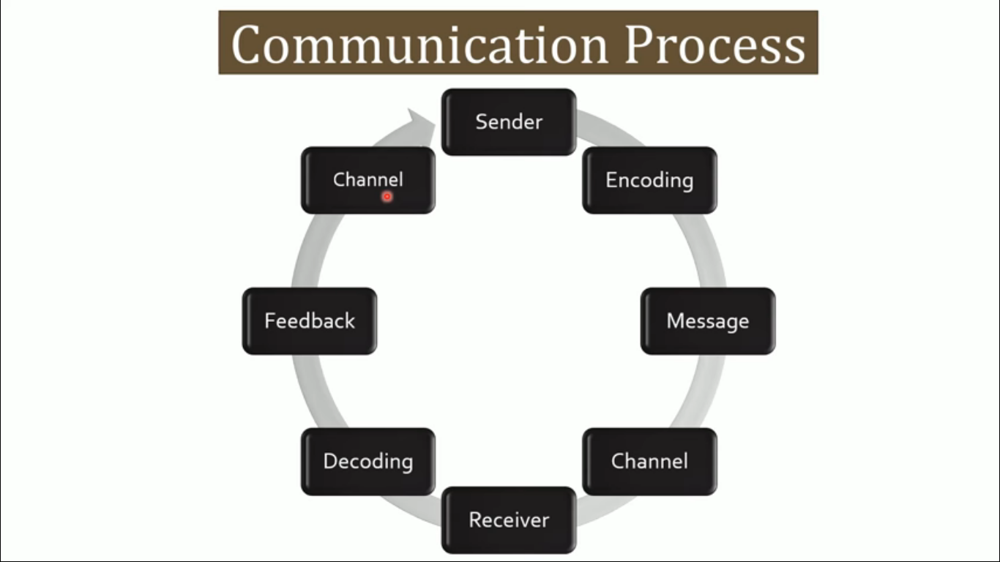
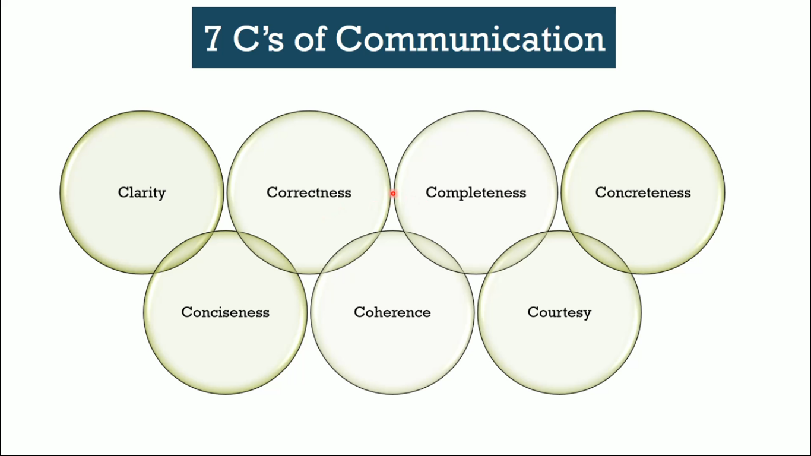

  <h1>Day2: What is Communication</h1>

## What is Communication

Communication is a two way process of conveying information, ideas, opinion between two or more persons either through verbal or non-verbal medium

## Communication Process

   

* Communication starts with the sender who wants to communicate something with others
* Encoding - Selecting the language which the receiver can understand (Medium of expression can be Speaking, writing, Eyecontact, Facial expression)
* Message - It is created by the sending using the right set of words and sentence
* Channel - Face-to-Face conversation, Telephonic conversation, Video calling, Letter, Email
* Receiver - The person to whom the message is directed
* Decoding - Interpretation of the message by the receiver

## Types of Communication

   

#### Verbal Communication
   * Oral Communication - Speaking
   * Written Communication - Email, Letters, SMS
   * Non-Verbal - Eyecontacts, Gestures
   * Visual Communication - Drawings, Typography, SignLanguages, Color

## 7C's of Communication

   

* Clarity - Clarity of the message (Language used must be simple and staright forward)
* Correctness - It should be of freeform from grammatical and spelling mistakes, Message should be exact and well-timed
* Completeness - Message should be completed that is it should contain all the facts and information required by the receipent
* Concretness - The content of your communication must be tangible there must be sufficient evidence to support your argument
* Conciseness - A short message is always preferred (Avoid the use of irrelevant details and usage)
* Coherence - There should be a logical releationship between the words we use
* Courtesy - Sender must be polite, open and honest with the receiver 