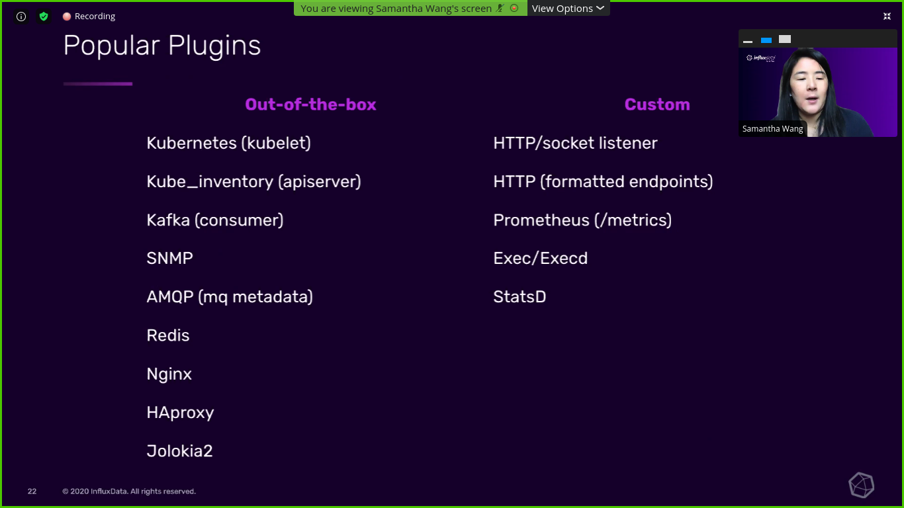
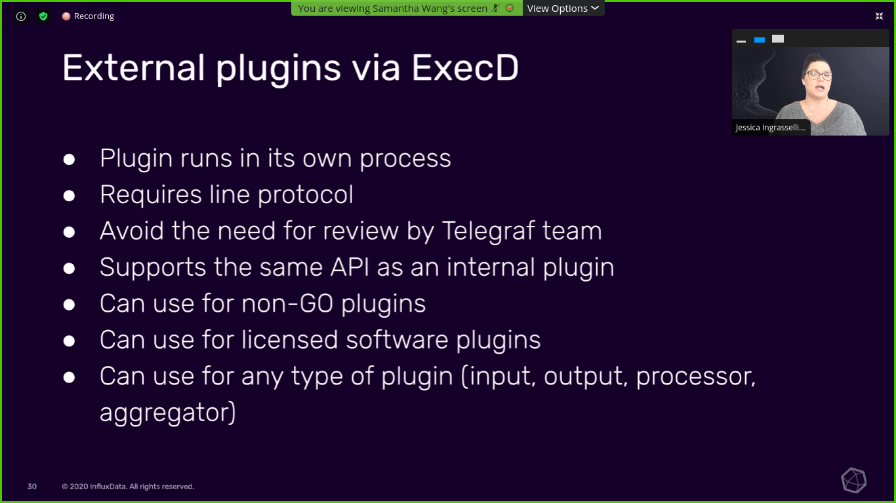

  <h1>Day4: Telegraf and Influx</h1>

## What is Telegraf and Influx

Influx is a real time series database which will collect the data from the Telegraf.The Role of Telegraf is to get the information/data from the iot devices.

## Influx 2.0

   

## Current Data Acquistion

   

## Telegraf Agent

   

## Telegraf Plugin Ecosystem

   

## What is in a Configuration file

   

## List of input plugins

   

   

   

## Popular plugins

   

## Set and Test configuration

   

## Writing own Plugin

   

## External Plugins Via Architecture

   

## Execd Plugin Architecture

   

## Resource Links

* [Telegraf Monitoring Template](https://www.influxdata.com/influxdb-templates/telegraf-monitor/?utm_source=webinar&utm_medium=referral&utm_campaign=2020-12-03_webinar_influxdata-telegraf_global)
* [Creating Custom Plugin](https://www.influxdata.com/training/write-your-own-telegraf-plugin/?utm_source=webinar&utm_medium=referral&utm_campaign=2020-12-03_webinar_influxdata-telegraf_global)